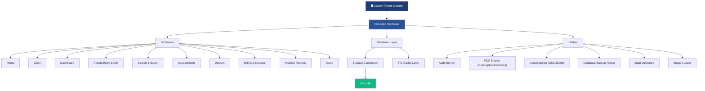
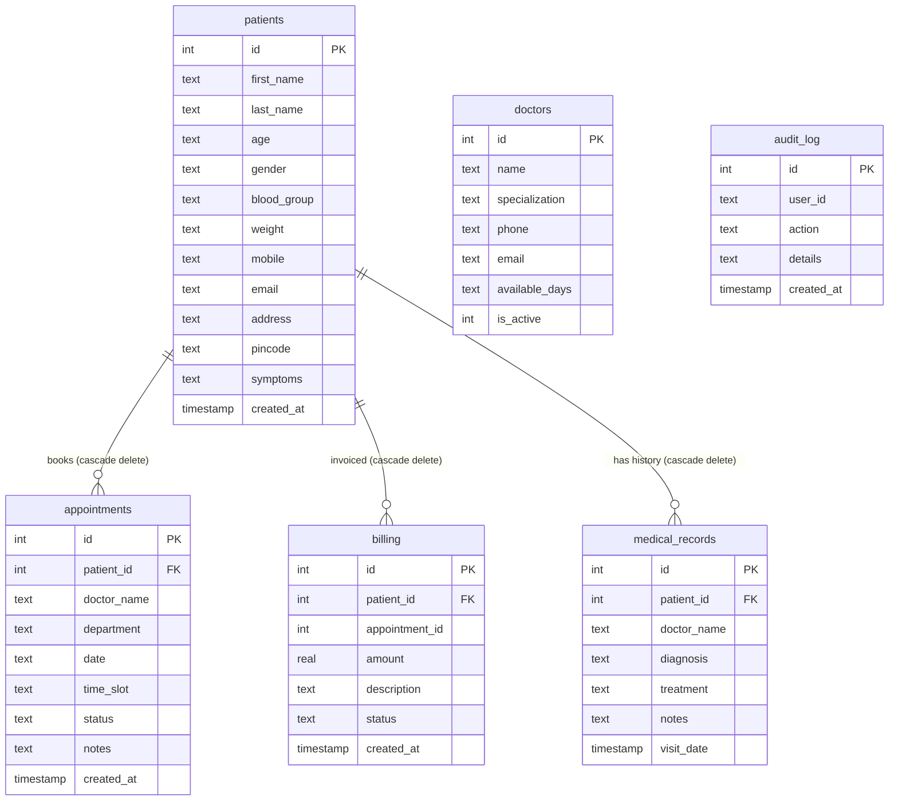

<div align="center">

# 🏥 WellCare Hospital Management System

**A modern, enterprise-grade desktop application for clinic operations, patient lifecycle management, and real-time healthcare analytics.**

[](https://github.com/AadityaBhuree/WellCare-Hospital-System/actions/workflows/ci.yml)
[](https://github.com/AadityaBhuree/WellCare-Hospital-System/actions/workflows/build.yml)
[](https://github.com/AadityaBhuree/WellCare-Hospital-System)
[](https://www.python.org/)
[](LICENSE)
[](https://github.com/astral-sh/ruff)
[](https://mypy-lang.org/)

Built with **CustomTkinter** · **SQLite** · **Matplotlib** · **FPDF2** · **bcrypt**

---

</div>

## 📋 Table of Contents

- [Features](#-features)
- [Tech Stack](#️-tech-stack)
- [Architecture](#-architecture)
- [Database Schema](#️-database-schema)
- [Getting Started](#-getting-started)
- [Configuration](#️-configuration)
- [Testing & Quality](#-testing--quality-assurance)
- [Building Executables](#-building-standalone-executables)
- [Project Structure](#-project-structure)
- [Contributing](#-contributing)
- [License](#-license)

---

## ✨ Features

### 🏠 Hospital Landing Page
A rich, branded landing page featuring the WellCare logo, hospital service showcase (Cardiology, Neurology, Diagnostics, Maternity, Orthopedics, Pharmacy), featured doctor cards, and emergency contact information — all rendered with image assets and responsive grid layouts.

### 📊 Analytics Dashboard *(Admin only)*
Interactive data visualization dashboard with switchable chart views:

| View | Charts |
| :--- | :--- |
| **Demographics** | Age distribution histogram, Gender pie chart, Blood group bar chart |
| **Medical** | Symptoms frequency, Appointment status breakdown |
| **Trend & History** | Patient registration timeline, Monthly trends |

Includes animated KPI cards (Total Patients, Today's Appointments, Active Doctors, Unpaid Invoices) with count-up animations and a configurable 10-second auto-refresh cycle.

### 📝 Patient Entry & Profile Editing
Complete form management for registering new patients or loading existing records by ID for inline editing and profile updates (`update_patient`).

### 👨‍⚕️ Doctor Directory Management
Full CRUD management for the medical staff directory — name, specialization, phone, email, and weekly availability schedule. Supports filtering by active/inactive status and dynamic integration with appointment booking dropdowns.

### 📋 Patient Medical Records & Consultation Timeline
Per-patient consultation logging with diagnosis, treatment plans, prescribing doctor, and timestamped visit history. Enables longitudinal tracking of a patient's complete medical journey.

### 💳 Billing & Financial Invoices
Financial management module with:
- Invoice creation linked to patient and appointment records
- Payment status tracking: `Pending` → `Paid` / `Partial` / `Refunded`
- Revenue KPI summary cards: Total Revenue, Pending Due, Paid Invoices, Unpaid Count
- **PDF Invoice Generation**: Instant export of professional, printable PDF payment receipts (`generate_invoice_pdf`).

### 📅 Appointment Scheduling
Interactive booking system with dynamic doctor lookup from database, department assignment, date format validation (`validate_date`), time slot selection, and status lifecycle (`Scheduled` → `In Progress` → `Completed` / `Cancelled` / `No Show`).

### 📄 PDF Document Engine
High-resolution PDF generation via `FPDF2` for prescriptions and financial receipts. Output files are automatically sanitized against path injection and saved to `Patient_Prescriptions/`.

### 📁 Data Export & Automated Backup
- **CSV & JSON Export**: One-click data export directly from the Search UI screen for reporting and analytics.
- **Database Backup Utility**: Automated timestamped backups (`backup_database`) created in `backups/clinic_backup_YYYYMMDD_HHMMSS.db`.

### 🔐 Security & Access Control

| Layer | Implementation |
| :--- | :--- |
| **Authentication** | bcrypt password hashing with constant-time comparison & rate-limited lockout |
| **Authorization** | Role-Based Access Control — `admin` (full analytics & management) vs `staff` (patient ops & billing) |
| **Data Integrity** | SQLite Foreign Key pragma enforcement (`PRAGMA foreign_keys = ON`) with cascade deletion |
| **Path Security** | Sanitized PDF filename generation preventing directory traversal vulnerabilities |
| **Configuration** | Environment isolation via `python-dotenv`, zero hardcoded credentials |
| **Audit Trail** | Action logging recorded in `audit_log` table with user, action type, and timestamp |

### 🎨 UI & Design System
Centralized design token system (`Theme` class) powering consistent typography, color palette, spacing, and border radii across all frames. Custom reusable widgets include `KPICard`, `ToastNotification`, and count-up animations. Supports **Light** and **Dark** appearance modes.

---

## 🛠️ Tech Stack

| Category | Technology | Purpose |
| :--- | :--- | :--- |
| **GUI** | CustomTkinter ≥ 5.2 | Modern tkinter-based desktop UI |
| **Visualization** | Matplotlib ≥ 3.5, Seaborn ≥ 0.12 | Charts, graphs, and analytics |
| **Database** | SQLite3 | Lightweight relational storage with indexes & FK enforcement |
| **PDF** | FPDF2 ≥ 2.5 | Prescription & Financial Invoice document generation |
| **Security** | bcrypt ≥ 4.0 | Password hashing & rate limiting |
| **Config** | python-dotenv ≥ 1.0 | Environment variable management |
| **Images** | Pillow ≥ 9.0 | Asset loading and image processing |
| **Linter & Formatter** | Ruff ≥ 0.8 | Code quality enforcement |
| **Type Checker** | mypy ≥ 1.10 | Static type analysis |
| **Testing** | pytest ≥ 7.0, pytest-cov ≥ 4.0 | Unit & integration test suite (159 tests) |
| **CI/CD** | GitHub Actions | Automated testing, linting & build pipeline |
| **Packaging** | PyInstaller ≥ 6.0 | Standalone Windows executable builds |

---

## 🏗 Architecture

The system follows a **Controller-Frame** pattern (MVC variant) with a centralized design token system and TTL-cached database access layer.



**Key design decisions:**
- **Frame isolation** — Each UI screen is a self-contained `CTkFrame` subclass with its own `_build_ui()` method, receiving a `controller` reference for navigation and database access.
- **TTL Cache** — A 3-second TTL in-memory cache wraps database reads to prevent redundant SQLite I/O during rapid frame transitions and auto-refresh cycles.
- **Audit logging** — Every critical database mutation is recorded in the `audit_log` table via `Database.log_action()`.
- **Design tokens** — All colors, fonts, spacing, and radii flow from a single `Theme` class, ensuring visual consistency without scattered magic values.

---

## 🗄️ Database Schema



**Performance indexes:** `patients.mobile`, `patients.last_name`, `appointments.patient_id`, `appointments.status`, `medical_records.patient_id`.

---

## 🚀 Getting Started

### Prerequisites

- **Python 3.10+** (tested on 3.10, 3.11, 3.12, 3.13)
- `pip` package manager

### Installation

**1. Clone the repository:**

```bash
git clone https://github.com/AadityaBhuree/WellCare-Hospital-System.git
cd WellCare-Hospital-System
```

**2. Quick setup (Windows):**

```cmd
.\setup.bat
```

**3. Manual setup (all platforms):**

```bash
# Create and activate virtual environment
python -m venv .venv
.venv\Scripts\activate       # Windows
source .venv/bin/activate    # Linux / macOS

# Install runtime + dev dependencies
pip install -r requirements.txt
pip install -r requirements-dev.txt
```

### Running the Application

```bash
python -m src.wellcare
```

### Default Credentials

> [!WARNING]
> These are development-only defaults. See [Configuration](#️-configuration) to set secure bcrypt-hashed passwords via `.env`.

| Role | Username | Password | Access Scope |
| :--- | :--- | :--- | :--- |
| **Administrator** | `admin` | `123` | Full system — Analytics Dashboard, Doctors, System Config |
| **Medical Staff** | `staff` | `123` | Patient Entry/Edit, Appointments, Billing & Invoices, Medical History |

---

## ⚙️ Configuration

Copy the template and customize:

```bash
cp .env.example .env
```

### Environment Variables Reference

| Variable | Default | Description |
| :--- | :--- | :--- |
| `APP_TITLE` | `WellCare Hospital Patient Management` | Window title bar text |
| `APP_GEOMETRY` | `1440x1024` | Initial window dimensions |
| `APP_MIN_WIDTH` | `900` | Minimum window width |
| `APP_MIN_HEIGHT` | `700` | Minimum window height |
| `APPEARANCE_MODE` | `Light` | UI theme — `Light` or `Dark` |
| `COLOR_THEME` | `blue` | CustomTkinter color accent |
| `ADMIN_USERNAME` | `admin` | Administrator login ID |
| `ADMIN_PASSWORD_HASH` | *(empty)* | bcrypt hash of admin password |
| `STAFF_USERNAME` | `staff` | Staff login ID |
| `STAFF_PASSWORD_HASH` | *(empty)* | bcrypt hash of staff password |
| `AUTO_REFRESH_INTERVAL_MS` | `10000` | Dashboard auto-refresh interval (ms) |

**Generating password hashes:**

```bash
python -c "import bcrypt; print(bcrypt.hashpw(b'your_password', bcrypt.gensalt()).decode())"
```

---

## 🧪 Testing & Quality Assurance

The project maintains **159 passing tests** across 17 test modules covering database operations, business logic, UI frame rendering, authentication, validators, backup utilities, and data export.

```bash
# Run the full test suite
pytest

# Run with verbose output and coverage
pytest -v --cov=src.wellcare --cov-report=term-missing

# Lint and format checks
ruff check src/ tests/
ruff format --check src/ tests/

# Static type checking
mypy src/
```

### CI Pipeline

Every push and pull request to `main` triggers GitHub Actions CI across **Python 3.10 – 3.13**:

1. **Lint** — `ruff check`
2. **Format** — `ruff format --check`
3. **Type check** — `mypy`
4. **Test** — `pytest` with coverage uploaded to Codecov

---

## 📦 Building Standalone Executables

Package the application as a portable Windows executable:

```bash
pyinstaller --noconfirm --onedir --windowed \
  --name "WellCare" \
  --add-data "assets;assets" \
  src/wellcare/__main__.py
```

The output bundle is generated at `dist/WellCare/`. The CI/CD pipeline also produces this artifact automatically on every push to `main` via GitHub Actions.

---

## 📂 Project Structure

```
WellCare-Hospital-System/
├── .github/workflows/
│   ├── ci.yml                  # CI — lint, format, type check, test (Py 3.10–3.13)
│   └── build.yml               # CD — PyInstaller executable packaging
│
├── src/wellcare/               # Application package
│   ├── __init__.py             # Package metadata & version
│   ├── __main__.py             # Entry point
│   ├── app.py                  # ClinicApp controller — navigation, state, frame lifecycle
│   ├── cache.py                # Thread-safe TTL cache (3s default)
│   ├── config.py               # Environment config loader (python-dotenv)
│   ├── database.py             # SQLite DAL — schema, CRUD, stats, audit log, FK pragma
│   ├── logger.py               # Centralized rotating file + console logger
│   ├── models.py               # Typed dataclasses & enums (Patient, Doctor, Bill, MedicalRecord, etc.)
│   │
│   ├── frames/                 # UI screens (one class per frame)
│   │   ├── home.py             #   Landing — services, doctors, emergency info
│   │   ├── about.py            #   System information & credits
│   │   ├── login.py            #   Authentication (bcrypt verification & rate limiter)
│   │   ├── dashboard.py        #   Admin analytics — KPIs + Matplotlib charts
│   │   ├── patient_entry.py    #   Patient registration & edit form + PDF print
│   │   ├── search.py           #   Patient search, delete & CSV/JSON export
│   │   ├── appointments.py     #   Appointment booking & doctor lookup
│   │   ├── doctors.py          #   Doctor directory CRUD
│   │   ├── billing.py          #   Invoice generation, payment status & PDF receipt
│   │   └── medical_records.py  #   Consultation timeline & diagnosis history
│   │
│   ├── ui/                     # Design system & reusable widgets
│   │   ├── theme.py            #   Color, typography & spacing tokens
│   │   ├── widgets.py          #   KPICard, ToastNotification, StatusBadge, FormField
│   │   └── animations.py       #   Count-up animations
│   │
│   └── utils/                  # Standalone helpers
│       ├── auth.py             #   bcrypt hashing & credential verification
│       ├── backup.py           #   Database backup & recovery helper
│       ├── exporter.py         #   CSV & JSON export
│       ├── image_loader.py     #   CTkImage asset loader
│       ├── pdf.py              #   FPDF2 prescription & invoice generator
│       └── validators.py       #   Input rules (email, phone, date, pincode, age)
│
├── tests/                      # 159 unit & integration tests (17 modules)
│   ├── conftest.py             #   Shared fixtures (mock DB, mock controller)
│   ├── test_app.py             #   Controller & navigation tests
│   ├── test_database.py        #   Patient & appointment DB operations
│   ├── test_backup.py          #   Database backup utility tests
│   ├── test_billing_db.py      #   Billing CRUD & stats tests
│   ├── test_billing_frame.py   #   Billing UI & PDF invoice tests
│   ├── test_doctors_db.py      #   Doctor CRUD tests
│   ├── test_doctors_frame.py   #   Doctors UI tests
│   ├── test_medical_records.py #   Medical history tests
│   ├── test_auth.py            #   Authentication & hashing tests
│   ├── test_config.py          #   Configuration loading tests
│   ├── test_validators.py      #   Input validation tests
│   ├── test_exporter.py        #   CSV/JSON export tests
│   ├── test_dashboard.py       #   Dashboard chart rendering tests
│   ├── test_login_frame.py     #   Login UI tests
│   ├── test_patient_entry_frame.py  # Patient form & edit tests
│   └── test_appointments_frame.py   # Appointments UI tests
│
├── assets/                     # Images — logo, service photos, doctor portraits
├── Patient_Prescriptions/      # Generated PDF output directory
├── backups/                    # Database backup directory
├── logs/                       # Application log files
│
├── .env.example                # Environment variable template
├── pyproject.toml              # Build, ruff, mypy & pytest config
├── requirements.txt            # Runtime dependencies
├── requirements-dev.txt        # Dev/test dependencies
├── setup.bat                   # Windows quick-setup script
├── CHANGELOG.md                # Version history (Keep a Changelog format)
├── CONTRIBUTING.md             # Contribution guidelines
├── LICENSE                     # MIT License
└── README.md
```

---

## 🤝 Contributing

Contributions are welcome! Please read [CONTRIBUTING.md](CONTRIBUTING.md) for guidelines.

**Quick start:**

```bash
# Fork & clone
git clone https://github.com/<your-username>/WellCare-Hospital-System.git
cd WellCare-Hospital-System

# Install with dev tools
pip install -r requirements.txt
pip install -r requirements-dev.txt

# Set up pre-commit hooks
pre-commit install

# Run the quality gates before submitting
ruff check src/ tests/
mypy src/
pytest
```

---

## 📄 License

This project is licensed under the **MIT License** — see the [LICENSE](LICENSE) file for details.

---

<div align="center">

**Developed by [Aditya Bhure](https://github.com/AadityaBhuree)**

</div>
